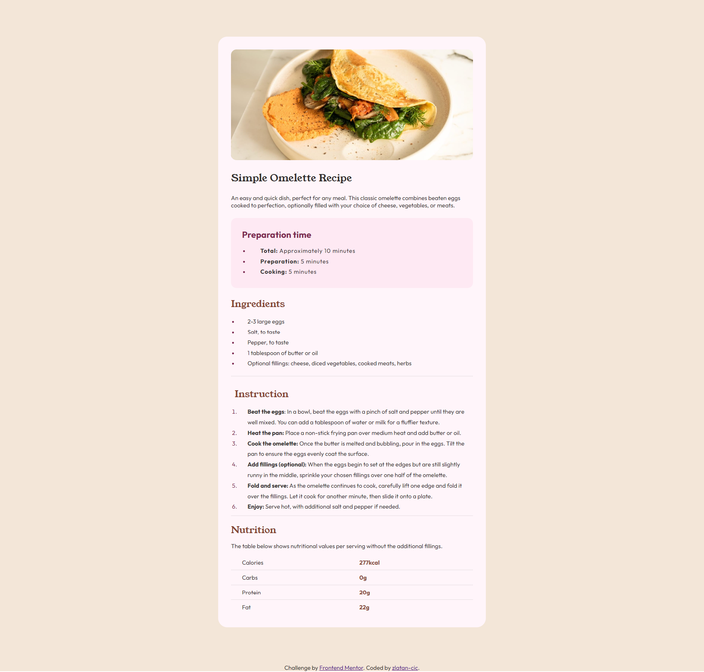
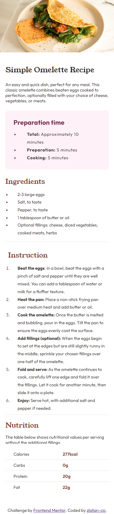

# Frontend Mentor - Recipe page solution

This is a solution to the [Recipe page challenge on Frontend Mentor](https://www.frontendmentor.io/challenges/recipe-page-KiTsR8QQKm). Frontend Mentor challenges help you improve your coding skills by building realistic projects. 

### Screenshot

#### Desktop

#### Phone

### Links

- Solution URL: [Add solution URL here](https://your-solution-url.com)
- Live Site URL: [Add live site URL here](https://your-live-site-url.com)

### Built with

- HTML5 markup
- CSS

### What I learned

I learned how to use CSS media queries to create responsive designs that adapt to different screen sizes. By hiding and displaying images conditionally, I ensured an optimized user experience on both mobile and desktop devices. This approach improves the layout's flexibility and enhances the overall aesthetic of the page.

## Author

- Frontend Mentor - [@zlatan-cic](https://www.frontendmentor.io/profile/zlatan-cic)
- GitHub - [zlatan-cic](https://github.com/zlatan-cic)
- Twitter - [@Zlatan_cic](https://twitter.com/Zlatan_cic)

## Acknowledgments

This project was inspired and built upon a challenge provided by Frontend Mentor. [Frontend Mentor](https://www.frontendmentor.io) offers a variety of real-world web development projects that simulate a professional workflow and encourage practical coding experience. I am thankful for the opportunity to tackle such challenges that enhance my front-end development skills and allow me to experiment with new ideas and technologies in a structured environment. A special thanks to Frontend Mentor for providing such an invaluable resource to the developer community.

